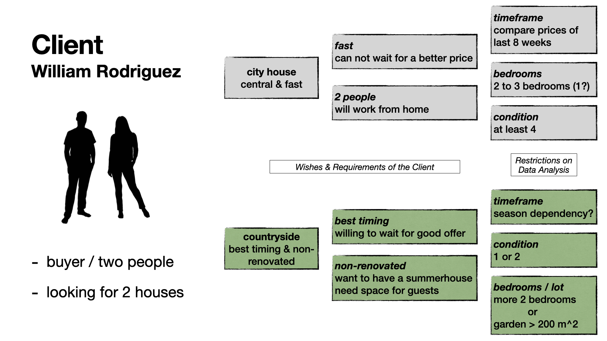

# Exploratory Data Analysis (EDA) project of King County House Sales

This repository was created as part of the _neuefische DataSience Bootcamp_, which I attended in spring 2024 to make my way out of academia and into the world of data and predictions. 

The aim of this EDA project is to demonstrate what we've learnt over the last few weeks in a (slightly) larger project.

## The Task

Out task was not only to perform an EDA on the the well known [King County House Sales](https://www.kaggle.com/datasets/harlfoxem/housesalesprediction/data) dataset, furthermore we had to:

- demonstrate some **_SQL skills_** in order to get the data from a neuefische SQL database
  - the code to retrieve the data is shown in the [Retrieving_Data_From_PostgreSQL](./Retrieving_Data_From_PostgreSQL.ipynbRet) notebook, it will not work though
- **_clean & correct_** the data, because neuefische introduced on purpose some noise to make the task for us students a bit more challenging ;)
- come up with three **_questions and specific hypotheses_** that we want to answer using the data set and with the help of the EDA
- help a **_virtual client_** with their specific needs, and think about how to meet the client's demands
- of course, **_perform an EDA_**
- and finally, to **_prepare and present a presentation_** that should be designed in such a way that a non-technical audience can follow it well, ideally the client
  - you'll find the presentation ([PDF](./slides/EDA.pdf)) in the [slides folder](./slides)

## The Dataset

The dataset, provided by neuefische, is a version of the widely used dataset of house sale prices for King County, which includes Seattle. It consists of homes sold between May 2014 and May 2015, and consists of the following columns/features:

| column name | description |
| --- | ----------- |
| id | unique identified for a house |
| date | house was sold |
| price | is prediction target |
| bedrooms | # of bedrooms |
| bathrooms | # of bathrooms |
| sqft_living | footage of the home |
| sqft_lot | footage of the lot |
| floors | floors (levels) in house |
| waterfront | House which has a view to a waterfront |
| view | quality of view |
| condition $^1$ | How good the condition is ( Overall ) |
| grade $^1$ | overall grade given to the housing unit, based on King County grading system |
| sqft_above | square footage of house apart from basement |
| sqft_basement | square footage of the basement |
| yr_built | Built Year |
| yr_renovated | Year when house was renovated |
| zipcode | zip |
| lat | Latitude coordinate |
| long | Longitude coordinate |
| sqft_living15 | The square footage of interior housing living space for the nearest 15 neighbors |
| sqft_lot15 | The square footage of the land lots of the nearest 15 neighbors |

$^1$: more information about the _Grade_ & _Condition_ categories may be [found here](https://info.kingcounty.gov/assessor/esales/Glossary.aspx?type=r)

## The Client

## The Hypothesis

Moreover, the following specific hypotheses will underpin the conclusions drawn from the data and support the final recommendations:

1. Houses in the city are more expensive than in the countryside.
2. The fluctuation of house prices over the course of the year depends on the region.
3. Houses in need of renovation are less affected by price fluctuations.

## The Workflow

... consists of the following steps:

- loading all neccessary modules
- loading & preparing the dataset into pandas and geopandas dataframes
- section with functions
- data cleaninig
  - inspection of all features and creating some more features out of the given ones
- data exploration
  - check distributions and correlations between features
- hypothesis testing

## The Notebook

The [**EDA notebook**](./EDA.ipynb) is prepared in a way to be rendered by the Github preview and still containing all the output figures and maps. Especially in the case of _folium maps_, which are not rendered by the Guthub preview, i need to implement a workaround. These maps are saved as images and then implemented into the notebook as static images in markdown cells. Hence, if you run the notebook locally, these folium maps will be duplicated.

_Note: The Notebook is approx. 12 MB big and is seems that GITHUB have some troubles to render larger notebooks. I tried it a few times, it should work. If you encounter problmens, please try again._

## The Environment

There is also a [**requirements.txt**](./requirements.txt) provided in order to install the virtual environment with all neccessary libraries. Simply create a new virtual environment using the method of your choice.

